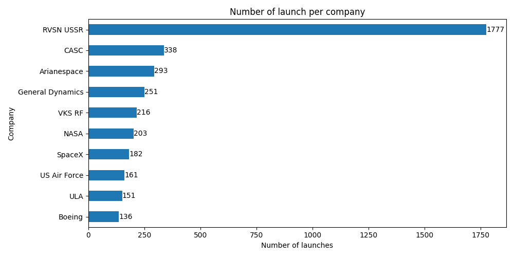
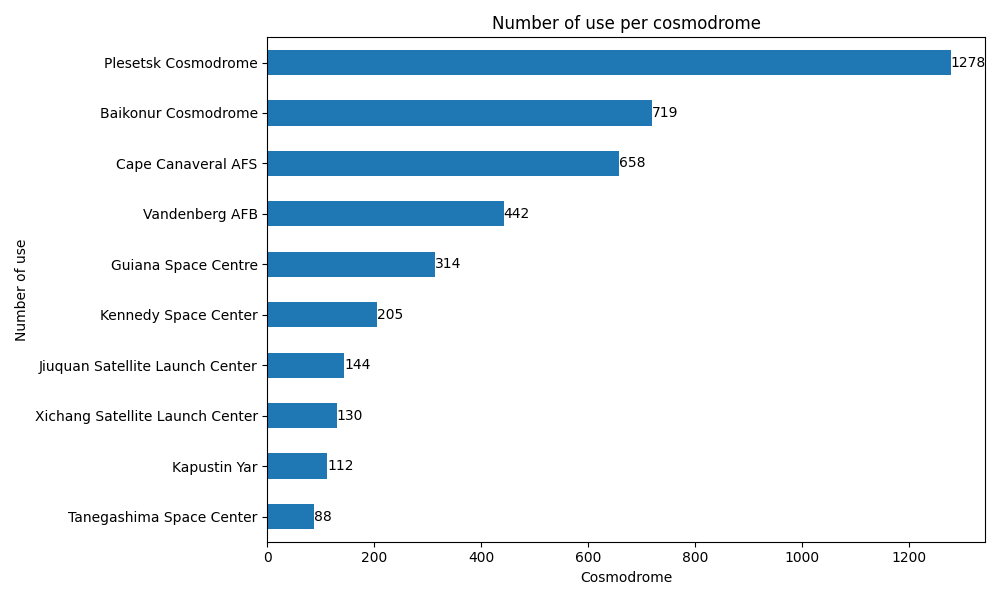
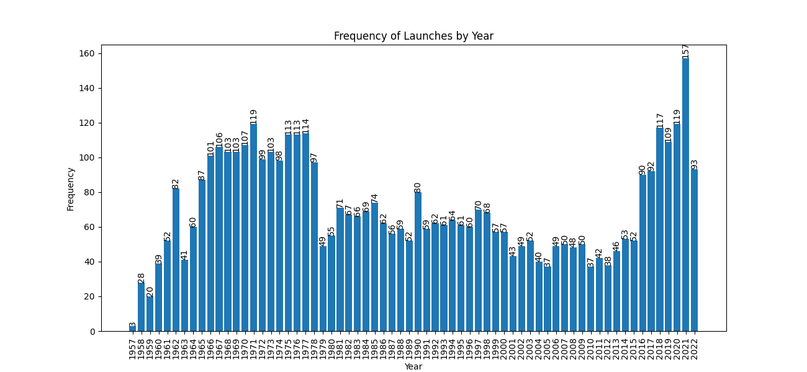
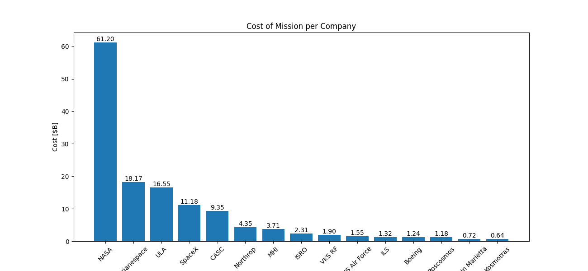

# Introduction
Dataset which I worked on comes from kaggle.com and cover space missions from October 1957 to August 2022, including details on the location, date, and result of the launch, the company responsible, and the name, price, and status of the rocket used for the mission.
# Background
This project was crafted to provide hands-on experience with SQL queries, data analysis techniques and gain practical skills in SQL while exploring various dimensions of space missions, including their frequency, costs, success rates, and temporal patterns, using real-world data related to space exploration. 🚀

🔍 All used queries in: [project_sql folder](/project_sql/)

🔍 jupyter wrokbook in: [space_jupyter_notebook.ipynb](/py_files/)

### Areas for analysis I wanted to cover are:

1. Basic statistics
2. Financial
3. Mission Successes
4. Temporal
5. Rockets
6. Combined analysis

# Tools I used

- **SQL:** The basis of my analysis, allowing me to query the database.
- **MySQL:** The chosen database management system.
- **Visual Studio Code:** Chosen IDE for executing SQL queries and managing database.
- **Git & GitHub:** For version control and sharing my SQL scripts and analysis.
- **Python:** (pandas, matplotlib)For converting .csv file for suitable encoding, cleaning and handing data, plotting graphs based on received query.
- **Power BI:** Used for creating understandable report.

# 1. Basic Statistics

To get basic insight, I showed company names with count of mission each, number of uses of each location and most popular month to executing space mission.

```sql
SELECT
    company,
    COUNT(DISTINCT mission) AS count_of_mission
FROM space_mission
GROUP BY company
ORDER BY count_of_mission DESC;

SELECT 
    DISTINCT SUBSTRING_INDEX(SUBSTRING_INDEX(location, ',', 2), ',', -1) AS cosmodrome,
    SUBSTRING_INDEX(location, ',', -1) AS cosmodrome_country,
    COUNT(SUBSTRING_INDEX(SUBSTRING_INDEX(location, ',', 2), ',', -1)) AS cosmodrome_count
FROM
    space_mission
GROUP BY cosmodrome, cosmodrome_country
ORDER BY cosmodrome_count DESC;

SELECT 
    EXTRACT(YEAR FROM date) AS years,
    COUNT(EXTRACT(YEAR FROM date)) AS count_of_occurences
FROM space_mission
GROUP BY years
ORDER BY years DESC;
```

## <ins>Number of space missions conducted by each company:</ins>

Analyzing the data on the count of missions for each company reveals several important insights into the landscape of space exploration and rocket launches:




<details>
  <summary><span style="color:#FFD241">(Python code for graph generation)</span></summary>
  
```python
# Count occurences of each comapny 
company_counts = df['Company'].value_counts().head(10)
print(company_counts)

#Sort
company_counts = company_counts.sort_values(ascending=True)
    
# Plot the graph
plt.figure(figsize=(10, 5))
ax = company_counts.plot(kind='barh')

# Adding labels on bars
for index, value in enumerate(company_counts):
    ax.text(value, index, str(value), va='center')

plt.xlabel('Number of launches')
plt.ylabel('Company')
plt.title('Number of launch per company')
plt.tight_layout()
plt.savefig('graphs/top_10_companies.png') #save in 
plt.show()
```
</details>

<br />

**1. Dominance of RVSN USSR**

RVSN USSR leads significantly with 1756 missions, highlighting the historical prominence and extensive activity of the Soviet Union in space exploration. This high number reflects the USSR's robust space program during the Cold War era, with a strong emphasis on satellite launches, interplanetary missions, and manned spaceflight.

**2. Prominence of CASC:**

CASC (China Aerospace Science and Technology Corporation) follows with 336 missions. This indicates China's substantial investment and rapid advancements in its space program, positioning itself as a major player in global space exploration.

**3. Strong European Presence:**

Arianespace, with 293 missions, underscores the significant role of the European space industry. Arianespace has been a key provider of commercial launch services, serving a wide range of international clients.

**4. Historical Impact of General Dynamics:**

General Dynamics, with 251 missions, played a crucial role during the earlier years of space exploration, contributing significantly to military and civilian space missions.

**5. Active Russian Federation:**

VKS RF (Russian Aerospace Forces) with 213 missions, continues the legacy of the Soviet space program, maintaining a high level of space launch activity in the post-Soviet era.

**6. Consistent Contributions by NASA:**

NASA's 203 missions reflect its sustained involvement in space exploration, scientific missions, and international collaborations. NASA's diverse missions range from manned spaceflights to deep space probes.

**7. Rapid Growth of SpaceX:**

SpaceX, with 179 missions, stands out as a rapidly growing player in the space industry. Founded in 2002, SpaceX's significant number of launches in a relatively short period highlights its innovation, cost-effectiveness, and the increasing role of private companies in space exploration.

**8. Role of the US Air Force:**

The US Air Force's 161 missions indicate its critical role in national security, satellite deployment, and technological advancements in space.

**9. Significant Activity by ULA:**

ULA (United Launch Alliance) with 151 missions, represents a key partnership between Boeing and Lockheed Martin, contributing to both governmental and commercial space missions.

**10. Boeing’s Historical Contributions:**

Boeing, with 136 missions, has been a longstanding contributor to space exploration, providing launch services and spacecraft for various missions.

<ins>**Conclusion:**</ins>

The data showcases a diverse and competitive field of space exploration, with significant contributions from both government agencies and private companies across different countries. 
- The high number of missions by RVSN USSR and CASC illustrates the strong historical and current capabilities of the Soviet Union/Russia and China in space exploration. 
- The presence of Arianespace and NASA highlights the importance of international cooperation and scientific missions. 
- SpaceX’s rapid ascent reflects the growing influence of private enterprise in space, promising increased innovation and reduced costs. 

This competitive landscape is poised to drive further advancements and achievements in space exploration in the coming years.

## <ins>Number of space missions conducted from each location:</ins>

Analyzing the dataset on the number of launches from various cosmodromes provides valuable insights into the global distribution and activity levels of spaceports:



<details>
  <summary><span style="color:#FFD241">(Python code for graph generation)</span></summary>
  
```python
def split_location(location):

#split 'location' on parts containing datas:
    
    parts = location.split(', ')
    
    site = None
    cosmodrome = None
    state = None
    country = None
    
    if len(parts) == 4:
        # Format: site, cosmodrome, state, country
        site = parts[0]
        cosmodrome = parts[1]
        state = parts[2]
        country = parts[3]
    elif len(parts) == 3:
        # Format: site, cosmodrome, country
        site = parts[0]
        cosmodrome = parts[1]
        state = None
        country = parts[2]
    elif len(parts) == 2:
        # Format: cosmodrome, country
        site = None
        cosmodrome = parts[0]
        state = None
        country = parts[1]
    elif len(parts) == 1:
        # Format: country
        site = None
        cosmodrome = None
        state = None
        country = parts[0]
    
    return site, cosmodrome, state, country

df_for_cosmodromes = df.copy()
df_for_cosmodromes[['Site', 'Cosmodrome', 'State', 'Country']] = df['Location'].apply(split_location).apply(pd.Series)

# Count occurences of each cosmodrome 
cosmodrome_counts = df_for_cosmodromes['Cosmodrome'].value_counts().head(10)
print(cosmodrome_counts)

#Sort
cosmodrome_counts = cosmodrome_counts.sort_values(ascending=True)
    
# Plot the graph
plt.figure(figsize=(10, 6))
ax = cosmodrome_counts.plot(kind='barh')

# Adding labels on bars
for index, value in enumerate(cosmodrome_counts):
    ax.text(value, index, str(value), va='center')

plt.xlabel('Cosmodrome')
plt.ylabel('Number of use')
plt.title('Number of use per cosmodrome')
plt.tight_layout()
plt.savefig('graphs/top_10_cosmodromes.png') #save in 
plt.show()
```
</details>

<br />

**1. Plesetsk Cosmodrome, Russia:**

With 1278 launches, Plesetsk Cosmodrome is the most active launch site in this dataset. Located in Russia, it has historically been a primary site for military and satellite launches, contributing significantly to the country's space capabilities.

**2. Baikonur Cosmodrome, Kazakhstan:**

Baikonur Cosmodrome, with 719 launches, is a key launch site for both Russian and international missions. Despite being located in Kazakhstan, it has been operated by Russia and is famous for launching the first human, Yuri Gagarin, into space.

**3. Cape Canaveral AFS, USA**

Cape Canaveral Air Force Station (AFS) has seen 658 launches, making it a pivotal site for U.S. space missions. It has been used for a wide range of launches, from military satellites to crewed missions.

**4. Vandenberg AFB, USA:**

Vandenberg Air Force Base (AFB) has 442 launches. It primarily supports polar orbit and intercontinental ballistic missile (ICBM) testing, playing a crucial role in national security and space exploration.

**5. Guiana Space Centre, France:**

Located in French Guiana, this spaceport has had 314 launches. It is Europe’s primary launch site and has been used for a variety of missions, including commercial satellite launches, owing to its advantageous equatorial location.

**6. Kennedy Space Center, USA:**

Kennedy Space Center, with 205 launches, is one of the most iconic launch sites, known for its crewed missions, including Apollo moon landings and Space Shuttle launches.

**7. Jiuquan Satellite Launch Center, China:**

This Chinese launch site has had 142 launches, underscoring China's growing presence in space exploration. It supports both crewed and uncrewed missions.

**8. Xichang Satellite Launch Center, China:**

Xichang has 128 launches, reflecting China's robust satellite launch capabilities, particularly for geostationary orbit missions.

**9. Kapustin Yar, Russia:**

Kapustin Yar, with 112 launches, has been a significant site for military and research launches in Russia's space history.

**10. Tanegashima Space Center, Japan:**

This Japanese launch site has seen 88 launches, highlighting Japan's active participation in space exploration, particularly through the Japan Aerospace Exploration Agency (JAXA).

**11. Satish Dhawan Space Centre, India:**

The Satish Dhawan Space Centre in India has had 82 launches, indicating India's growing role in space exploration through the Indian Space Research Organisation (ISRO). This center supports a variety of missions, including satellite deployment and interplanetary exploration.

<ins>**Conclusion:**</ins>

This dataset highlights the strategic importance of various cosmodromes around the world. Key observations include:

- **Russia’s Dominance:** Russian launch sites (Plesetsk, Baikonur, Kapustin Yar) account for a significant portion of global launches, reflecting Russia’s historical and ongoing investment in space capabilities.

- **U.S. Infrastructure:** The United States has multiple high-activity launch sites (Cape Canaveral AFS, Vandenberg AFB, Kennedy Space Center), indicating a robust and diverse space launch infrastructure supporting military, scientific, and commercial missions.

- **European and Asian Contributions:** The Guiana Space Centre plays a critical role for Europe, while China’s Jiuquan and Xichang centers demonstrate China’s expanding space program. Japan’s Tanegashima Space Center and India’s Satish Dhawan Space Centre signify the active participation of these nations in space activities.

Overall, the distribution of launches underscores the collaborative and competitive nature of global space exploration, with each region leveraging its strategic advantages to advance its space ambitions.

## <ins>Number of space missions in each year:</ins>

Analyzing the data on the number of rocket launches over the years reveals several key trends and conclusions:



<details>
  <summary><span style="color:#FFD241">(Python code for graph generation)</span></summary>
  
```python
#Create new dataframe for 'Date' column
df_date = df[['Date']]

#Change datatype for datetime format
df_date['Date'] = pd.to_datetime(df_date['Date'])

#Adding column to df_date 
df_date['Year'] = df_date['Date'].dt.year

#check occurrences 'Year'
year_counts = df_date['Year'].value_counts().reset_index()

#Change column name
year_counts.columns = ['Year', 'Frequency']

#Sort by 'Year'
year_counts = year_counts.sort_values(by='Year')


# Plot the graph
plt.figure(figsize=(13, 6))
plt.plot(year_counts['Year'], year_counts['Frequency'], marker='o', linestyle='-')
plt.xlabel('Year')
plt.ylabel('Frequency')
plt.title('Frequency of Launches by Year')
plt.xticks(year_counts['Year'], rotation=90)
plt.show()

#two types of graph

plt.figure(figsize=(13, 6))
bars = plt.bar(year_counts['Year'], year_counts['Frequency'])
for bar in bars:
    yval = bar.get_height()
    plt.text(bar.get_x() + bar.get_width() / 2, yval, int(yval), ha='center', va='bottom', rotation = 90)
plt.xlabel('Year')
plt.ylabel('Frequency')
plt.title('Frequency of Launches by Year')
plt.xticks(year_counts['Year'], rotation = 90)
plt.savefig('graphs/years_freq.png') #save in 
plt.show()
```
</details>

<br />

**Early Development and Low Activity (1957-1969):**

The period from 1957 to around 1960 is characterized by a very low number of rocket launches, which is understandable given the early stages of space exploration.
During the 1960s, the number of launches gradually increases, reaching higher levels in 1967 with 106 launches, associated with intensive space programs, including preparations for the Moon landing in 1969.

**Increase in the 1970s:**

The 1970s saw a period of high space activity, with the number of rocket launches often exceeding 100 annually, peaking in 1971 with 119 launches.
This decade was a time of significant technological advancement and numerous missions.

**Decline and Stabilization in the 1980s and 1990s:**

The 1980s show a decline in the number of launches, but the level remains relatively stable, ranging from 50 to 80 launches per year.
The 1990s exhibit further stabilization with minor fluctuations, likely due to the end of the Cold War and shifting priorities in space programs.

**Renewed Increase Since 2000:**

From the beginning of the 21st century, the number of rocket launches begins to rise again. Although the early part of this decade is relatively calm, the number of launches gradually increases.
A significant increase occurs from 2010 onwards, with a noticeable surge from 2015 and reaching the highest values in recent years, especially in 2021 with 157 launches.

**Reasons for the Recent Increase:**

- The recent rise in the number of rocket launches is likely driven by several factors, including the development of the private space sector with companies like SpaceX, Blue Origin, and other private space enterprises.
- The increase in scientific, commercial, and military missions, including advancements in satellite technology and interplanetary exploration, also contributes to this growth.

In summary, this data shows the dynamic development of rocket technology and space exploration, with clear phases of growth, stabilization, and renewed increase in recent years. The current upward trend suggests continued development and intensification of space activities in the coming years.

# 2. Financial Analysis

To get insight, I wanted to analyze financial aspects of space missions (There were taken only missions where data available and misison is not test mission(Demo Flight, Test Flight e.g.))

```sql
SELECT
    company,
    ROUND(sum(Cost),2) AS sum_of_mission_cost
FROM space_mission
GROUP BY company
ORDER BY sum_of_mission_cost DESC;

SELECT
    mission,
    cost,
    ROUND(AVG(cost) OVER (PARTITION BY mission), 2) AS average_cost_of_mission,
    COUNT(*) OVER (PARTITION BY mission) AS launch_count
FROM space_mission
ORDER BY cost DESC;

--most / least expensive (changing order ASC <-> DESC)
SELECT
    DISTINCT company,
    mission,
    cost,
    total_cost,
    launch_count
FROM (
    SELECT
        company,
        mission,
        cost,
        ROUND(SUM(cost) OVER (PARTITION BY mission), 2) AS total_cost,
        COUNT(*) OVER (PARTITION BY mission) AS launch_count
    FROM space_mission
        WHERE cost IS NOT NULL
) AS temp_table
WHERE total_cost > 0
ORDER BY total_cost DESC
LIMIT 1;
```

## <ins>Total cost of missions for each company:</ins>

The dataset on the summary cost of missions for each company reveals important financial trends and investment priorities in the space industry:




<details>
  <summary><span style="color:#FFD241">(Python code for graph generation)</span></summary>
  
```python
# Count occurences of each comapny 
company_counts = df['Company'].value_counts().head(10)
print(company_counts)

#Sort
company_counts = company_counts.sort_values(ascending=True)
    
# Plot the graph
plt.figure(figsize=(10, 5))
ax = company_counts.plot(kind='barh')

# Adding labels on bars
for index, value in enumerate(company_counts):
    ax.text(value, index, str(value), va='center')

plt.xlabel('Number of launches')
plt.ylabel('Company')
plt.title('Number of launch per company')
plt.tight_layout()
plt.savefig('graphs/top_10_companies.png') #save in 
plt.show()
```
</details>

<br />

- **High Investment by NASA (<ins>$76.280 bilion</ins>) :** NASA's substantial expenditure reflects its comprehensive and ambitious space program, covering a wide range of scientific and exploratory missions.
- **Significant Commercial Expenditures (<ins>$45.906 bilion</ins>) :**  Arianespace, ULA, and SpaceX represent major commercial entities with significant investments in space launch services, catering to diverse clients worldwide.
- **Historical and Ongoing National Investments (<ins>$21.254 bilion</ins>) :** The costs associated with RVSN USSR and VKS RF illustrate the long-term commitment of the Soviet Union and Russia to space activities. Similarly, CASC's expenditures highlight China's growing ambitions in space exploration.
- **Efficiency and Cost-Effectiveness:** Organizations like ISRO (<ins>$2.307 bilion</ins>) and SpaceX (<ins>$11.181 bilion</ins>) are notable for their relatively lower costs, demonstrating efficiency and innovation in their mission execution.

## <ins>Most expensive and least expensive mission:</ins>

| Company - Mission | Cost [milion] | Description |
| ----------- | ----------- | ----------- |
| RVSN USSR - Buran Mission | 5,000 | The Buran program was the Soviet Union's response to the U.S. Space Shuttle program. The substantial cost reflects the ambitious nature of developing a reusable spacecraft capable of carrying both crew and cargo to orbit. Despite its potential, the program was eventually discontinued after a single unmanned flight in 1988 due to the dissolution of the Soviet Union and budget constraints. |
| Astra - Rocket 3.1 Mission | 2.5 | Astra's Rocket 3.1 mission represents a much smaller-scale operation in comparison. Astra is a private American space startup focused on providing cost-effective small satellite launch services. The relatively low cost of the Rocket 3.1 mission illustrates Astra's business model of low-cost, frequent launches aimed at capturing the growing market for small satellite deployments. |

The stark contrast in costs between the Buran mission and Astra's Rocket 3.1 mission comes from the historical vs. modern context. The Buran mission was a Cold War-era project with considerable government funding and a focus on large-scale, complex missions. In contrast, Astra's mission reflects a modern trend towards privatization and cost-efficiency in the space industry, driven by commercial demand and advancements in technology.

# 3. Mission Success Analysis

This analysis measures the overall success rate of rocket launches for each company by comparing the number of successful launches to the total number of company's launches (For companies which have at least 10 launch).


```sql
SELECT
    DISTINCT p.company,
    success_table.success_count,
    total_launches - success_table.success_count AS failure_table_failure_count,
    ROUND(((success_table.success_count)/(total_launches)) * 100, 2) AS success_percentage_rate
FROM space_mission p
LEFT JOIN
    (SELECT
        company,
        COUNT(company) AS success_count
    FROM space_mission
    WHERE missionstatus = "Success" GROUP BY company) AS success_table
ON
    success_table.company = p.company
LEFT JOIN
    (SELECT
        company,
        COUNT(company) AS total_launches
    FROM space_mission
    GROUP BY company) AS total_launches_table
ON
    total_launches_table.company = p.company
WHERE total_launches_table.total_launches >= 10
ORDER BY success_percentage_rate DESC;

-- Those two queries shows same output but the query above uses JOIN statments and bellow - CTE (Common Table Expressions).

WITH
launch_counts_table AS (
    SELECT
        company,
        COUNT(*) AS total_launches,
        SUM(CASE WHEN missionstatus = 'Success' THEN 1 ELSE 0 END) AS success_count,
        SUM(CASE WHEN missionstatus LIKE '%failure%' THEN 1 ELSE 0 END) AS failure_count
    FROM
        space_mission
    GROUP BY
        company),
success_rate_table AS (
    SELECT
        company,
        success_count,
        failure_count,
        total_launches,
        ROUND(((success_count)/(failure_count + success_count))*100, 2) AS success_rate
    FROM
        launch_counts_table)
SELECT * FROM success_rate_table
WHERE total_launches >= 10
ORDER BY success_rate DESC;
```

### Success Rate Categories

| **Category**                | **Success Rate Range** | **Companies**                                                                                      |
|-----------------------------|-------------------------|---------------------------------------------------------------------------------------------------|
| **High Success Rate**       | 95% and above           | Starsem, Blue Origin, ULA, ILS, Boeing, Arianespace, Kosmotras, MHI                             |
| **Moderately High Success Rate** | 90% to 94.99%       | SpaceX, CASC, Lockheed, VKS RF, Roscosmos, Eurockot, Sea Launch, NASA, RVSN USSR               |
| **Moderate Success Rate**   | 80% to 89.99%          | Northrop, Rocket Lab, Martin Marietta, ISAS, ISRO, IAI, General Dynamics, US Air Force, ExPace |
| **Low Success Rate**        | Below 80%              | ESA, ISA, US Navy                                                                                 |

### Broader Implications

- **Reliability Leaders:** Companies like ULA, SpaceX, and CASC are leading the industry with high numbers of launches and high success rates. Their consistent performance builds trust among clients and supports the growth of the commercial space industry.

- **New Entrants and Smaller Players:** Companies like Blue Origin and Rocket Lab, despite having fewer launches, demonstrate strong reliability, indicating their potential for growth in the market.

- **Historical Performance:** Companies like Blue Origin and Rocket Lab, despite having fewer launches, demonstrate strong reliability, indicating their potential for growth in the market.

# 4. Temporal Analysis
# GRAPH!!!!!!! 
This metric displays the count of space launch conducted during each month of the year, providing a monthly breakdown of mission activity
```sql
SELECT 
    month_value,
    COUNT(month_value) AS month_occurence
FROM(SELECT EXTRACT(MONTH FROM date) AS month_value FROM space_mission) AS month_table
GROUP BY month_value
ORDER BY month_occurence DESC;
```

- **Summer Months** (June, July, August) show relatively high occurrences, with June at **431**, July at **380**, and August at **391**. This trend indicates that summer is a busy period for rocket launches, which might be due to favorable launch conditions, availability of resources, or planned mission schedules.

- **Fall Months** (September, October, November) also exhibit high activity, with September at **386**, October at **403**, and November at **365**. The continued high activity during these months suggests that the end of the year is a period of intensive launch operations.

- **Spring and Early Months** (March, April, May) show moderate activity, with March at **378**, April at **409**, and May at **350**. This consistency indicates stable launch operations but without the peaks observed in summer or December.

# 5. Rocket Analysis
# GRAPH!!!!!!! 

```sql
SELECT 
    DISTINCT rocket,
    COUNT(rocket) AS rocket_used
FROM space_mission
GROUP BY rocket
ORDER BY rocket_used DESC;
```
## <ins>Number of launch for each rocket:</ins>
 This metric displays the count of launch conducted using each specific rocket, highlighting their utilization.

### Observation

- It indicates that a few rocket models, such as **Cosmos-3M** and **Voskhod**, are extensively used in space missions, reflecting their proven reliability and versatility. 
- Modern rockets like **Falcon 9 Block 5** are also making significant impacts, illustrating the shift towards newer technologies in space exploration.
- The variation in usage frequencies underscores the diverse roles and preferences in rocket selection for different mission requirements.

# 6. Combined Analyses
# GRAPH!!!!!!! 
This section contains various analysis.

```sql
SELECT
    company,
    cosmodrome,
    region,
    COUNT(cosmodrome) AS cosmodrome_count
FROM(SELECT
    company,
    location,
    IF(location LIKE '%,%,%,%',
        SUBSTRING_INDEX(location, ',', 1),
        IF(location LIKE '%,%,%',
            SUBSTRING_INDEX(location, ',', 1),
            NULL)) AS `site`,
    IF(location LIKE '%,%,%,%',
        SUBSTRING_INDEX(SUBSTRING_INDEX(location, ',', 2), ',', -1),
        IF(location LIKE '%,%,%',
            SUBSTRING_INDEX(SUBSTRING_INDEX(location, ',', 2), ',', -1),
            NULL)) AS `cosmodrome`,
    IF(location LIKE '%,%,%,%',
        SUBSTRING_INDEX(SUBSTRING_INDEX(location, ',', 3), ',', -1),
        NULL) AS `state/district`,
        SUBSTRING_INDEX(location, ',', -1) AS region
    FROM space_mission) AS site
GROUP BY company, cosmodrome, region
ORDER BY cosmodrome_count DESC;

SELECT
    DISTINCT rocket,
    MIN(date) OVER (PARTITION BY rocket) AS first_launch,
    MAX(date) OVER (PARTITION BY rocket) AS last_launch,
    TIMESTAMPDIFF(year, MIN(date) OVER (PARTITION BY rocket), MAX(date) OVER (PARTITION BY rocket)) AS duration,
    COUNT(rocket) OVER (PARTITION BY rocket) AS number_of_starts,
    rocketstatus
FROM space_mission
WHERE rocketstatus = 'Retired'
ORDER BY duration DESC;

SELECT
    rocket,
    MIN(date) OVER (PARTITION BY rocket) AS first_launch,
    MAX(date) OVER (PARTITION BY rocket) AS last_launch,
    TIMESTAMPDIFF(year, MIN(date) OVER (PARTITION BY rocket), MAX(date) OVER (PARTITION BY rocket)) AS duration,
    rocketstatus
FROM space_mission
WHERE rocketstatus = 'Active'
ORDER BY duration DESC
LIMIT 1;
```

## <ins>Number of launch conducted by each company from each location:</ins> 
This metric displays the count of launch conducted by each company from various launch locations, providing insight into the geographical distribution of their activities.

- **USA** hosts several major cosmodromes including **Cape Canaveral AFS** and **Kennedy Space Center**, which are heavily utilized by companies such as **NASA, General Dynamics, SpaceX**, and **Lockheed**. This reflects the strategic importance of these sites for American space operations.
- **Russia's Plesetsk Cosmodrome** and **Baikonur Cosmodrome** are central to **RVSN USSR** and **VKS RF** operations, indicating their dominance in Russian space missions.
- **China's Xichang Satellite Launch Center**, **Jiuquan Satellite Launch Center**, and **Taiyuan Satellite Launch Center** are key sites for **CASC**, showcasing China's growing space launch capabilities.
- **Japan's Tanegashima Space Center** and **India's Satish Dhawan Space Centre** are less frequent but still significant, with launches from **MHI** and **ISRO**, respectively.

## <ins> Important dates of each retired rocket</ins> 
This metric shows the first and last launch dates, as well as the duration and count of launch for which each rocket remained active, providing a comprehensive timeline of its operational history.

- **Soyuz U** and **Cosmos-3M (11K65M)** are the longest-running rockets, with operational durations of **43** and **42** years, respectively. This longevity reflects their significant roles in space missions over several decades.
- **Molniya-M /Block 2BL** and **Tsyklon-2** have durations of **38** and **36** years, respectively, indicating their extended use in space programs.

- **The Space Shuttle series**, including **Discovery**, **Atlantis**, and **Endeavour**, shows varying numbers of starts and durations. Discovery had **39** starts over **26** years, **Atlantis** had **33** starts over **25** years, and **Endeavour** had **25** starts over **19** years. These shuttles were key players in NASA’s space programs and contributed significantly to missions.

### Conclusion
The dataset reveals that several rockets, such as **Soyuz U** and **Cosmos-3M (11K65M)**, were extensively used and had long operational lifespans, making significant contributions to space missions. The Space Shuttle program also had a considerable impact with multiple shuttles over its lifetime. The varying number of launches and durations across different rockets illustrate the evolution of space launch technology and the transition to newer systems. The overall trend shows a shift from older, highly-utilized rockets to newer models as space exploration continues to advance.

## <ins>Oldest rocket which is still on duty:</ins> 
Table below displays the oldest rocket that is still in service, showing its 'on duty time' and providing insight into its operational longevity.

| Rocket | First launch | Last launch | Duration | Rocketstatus |
| ----------- | ----------- | ----------- | ----------- | ----------- |
| Long March 2C | 1982-09-09 | 2022-07-15 | 39 | Active |

The dataset provides details of the **Long March 2C** rocket which has had a remarkable operational life spanning **39 years** (**September 9, 1982 - July 15, 2022**) and remains **Active**. This extensive duration underscores its reliability and effectiveness in supporting space missions over several decades. The ongoing use of the **Long March 2C** reflects its significant role in China's space program and its ability to meet the demands of modern space exploration.